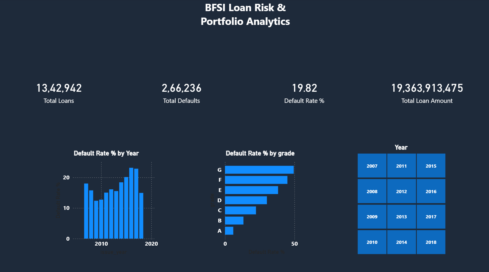
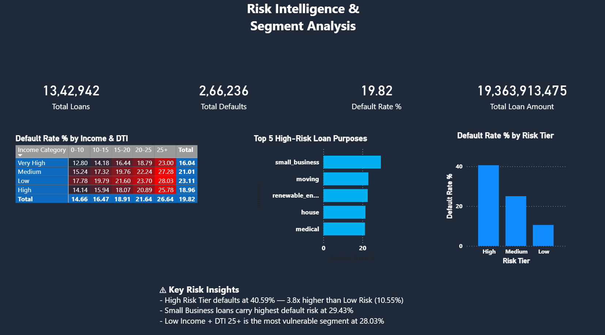
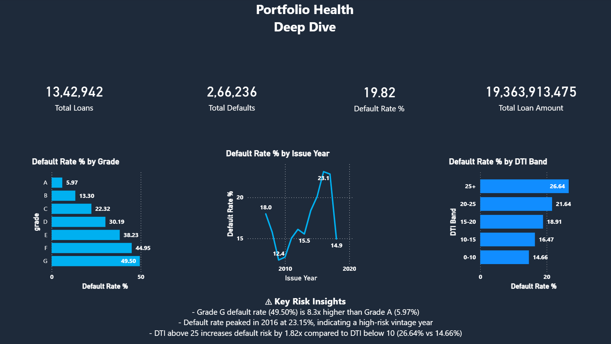
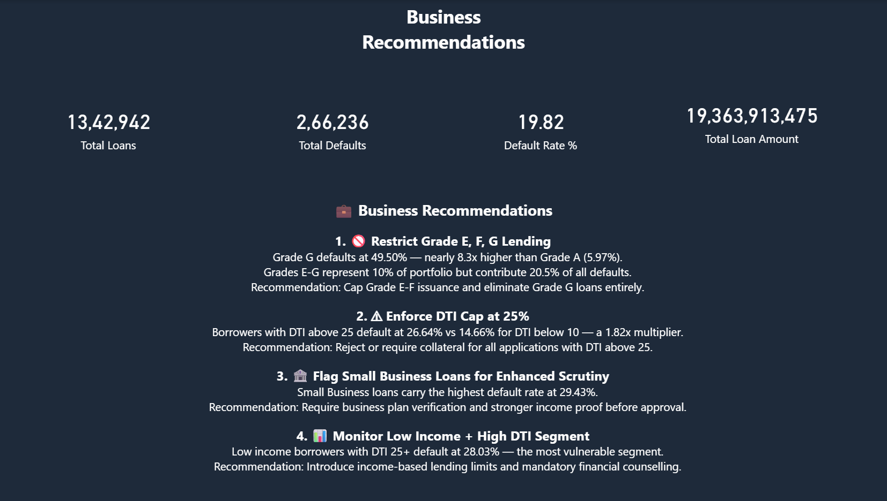
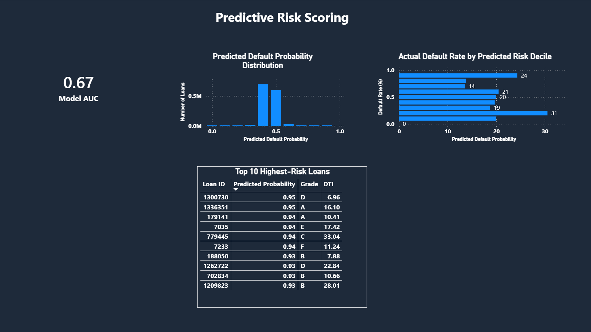

# 🏦 BFSI Loan Risk & Portfolio Analytics


A comprehensive **Data Analytics project** built on 1.34 million real-world loan records from the Lending Club dataset. This project covers the full data analyst pipeline — from raw data cleaning to a 5-page interactive Power BI dashboard — with a focus on loan default risk, portfolio health, and actionable business recommendations for a BFSI (Banking, Financial Services & Insurance) context.

Extended with a **cloud data warehouse layer** using Google BigQuery and a **dbt transformation pipeline** (staging → intermediate → marts), with the Power BI dashboard reconnected to run live off the cloud layer, plus a **BigQuery ML** logistic regression model scoring every loan's predicted default probability.

---

## 🔗 Links

| Resource | Link |
|---|---|
| 📊 Live Dashboard (BigQuery + BQML, 5 pages) | [View Dashboard](https://app.powerbi.com/view?r=eyJrIjoiNDQwZDE0NTctY2JjOC00ZTkyLWI2MjMtMzkxMjE4ZjZlOWNmIiwidCI6ImRiMTljMjFjLWFlODctNDY4Yi05MjQ4LTFhMjkyZDM3OWRjMiJ9) |
| 📦 Download .pbix (BigQuery + BQML) | [GitHub Release](https://github.com/ShreenivasSB/BFSI-Loan-Analytics/releases/tag/dashboard-v2) |
| 💼 LinkedIn | [Shreenivas S B](https://www.linkedin.com/in/shreenivas-s-b-22b48a31a/) |
| 🐙 GitHub Profile | [ShreenivasSB](https://github.com/ShreenivasSB) |

---

## 📌 Project Objective

To analyze a large-scale BFSI loan dataset and identify key risk drivers behind loan defaults — across loan grades, DTI bands, income segments, and loan purposes — and present findings through a professional Power BI dashboard with clear business recommendations.

> ⚠️ This is a **Data Analyst** project at its core — insights are primarily derived from statistical analysis, SQL queries, and visual storytelling, not ML engineering. It's since been extended with a scoped **BigQuery ML** default-risk model (plain SQL `CREATE MODEL`/`ML.PREDICT`, no Vertex AI or Python — see the "BigQuery ML — Predictive Default Risk Scoring" section below), kept intentionally lightweight to stay within Data Analyst scope rather than turn this into an MLE/DS project.

---

## 🛠️ Tools & Technologies

| Tool | Purpose |
|---|---|
| Python 3.12.4 | Data cleaning, feature engineering, EDA, statistical validation, BigQuery data load |
| MySQL | Local star schema design, SQL query library, query benchmarking |
| Google BigQuery | Cloud data warehouse — free tier (10 GB storage, 1 TB queries/month) |
| dbt 1.11 | 3-layer transformation pipeline: staging → intermediate → marts |
| BigQuery ML | Logistic regression default risk model — `CREATE MODEL` / `ML.EVALUATE` / `ML.PREDICT` |
| Ollama (`llama3:8b`, local) | AI-generated risk narrative bullets — zero-cost, runs entirely on-device |
| Power BI Desktop | 5-page interactive dashboard — reconnected to BigQuery |
| VS Code | Python scripting and development environment |

---

## 📂 Project Structure

```
BFSI_Loan_Analytics/
│
├── assets/
│   └── screenshots/
│
├── data/
│   ├── raw/
│   │   ├── accepted_2007_to_2018Q4.csv.gz   # Original raw dataset
│   │   └── lending_club_loans.csv            # Raw CSV
│   └── processed/                            # Cleaned & engineered CSVs
│
├── notebooks/
│   ├── 01_data_quality_audit.ipynb           # Data cleaning (1,342,942 rows, 0 nulls)
│   ├── 02_feature_engineering.ipynb          # Feature engineering (91 columns)
│   ├── 03_eda.ipynb                          # Exploratory Data Analysis (6 charts)
│   ├── 04_statistical_validation.ipynb       # 4 statistical tests
│   └── 05_mysql_ingestion.ipynb              # MySQL star schema loading
│
├── sql/
│   ├── query_library.sql                     # 6 analytical SQL queries
│   ├── explain_benchmarks.md                 # Query performance benchmarks
│   └── bqml/
│       └── train_default_risk_model.sql      # BQML logistic_reg training query
│
├── dbt/
│   └── bfsi_dbt/
│       ├── dbt_project.yml
│       ├── tests/
│       │   └── assert_predicted_default_probability_between_0_and_1.sql
│       └── models/
│           ├── sources.yml                   # BigQuery raw source definition
│           ├── staging/
│           │   └── stg_loans.sql             # Column renaming, type casting
│           ├── intermediate/
│           │   └── int_loans_enriched.sql    # Surrogate key generation
│           └── marts/
│               ├── fact_loans.sql            # 1,342,942 row fact table
│               ├── dim_grade.sql             # 7 rows
│               ├── dim_purpose.sql           # 14 rows
│               ├── dim_income_band.sql       # 4 rows
│               ├── dim_dti_band.sql          # 5 rows
│               ├── dim_risk_tier.sql         # 3 rows
│               ├── fct_loan_predictions.sql  # ML.PREDICT scores from model_default_risk
│               └── schema.yml                # 44 data quality tests
│
├── scripts/
│   ├── load_to_bigquery.py                   # CSV → BigQuery raw loader
│   ├── refresh_dbt_build.ps1                 # Weekly task: keeps 60-day free-tier tables from expiring
│   └── generate_risk_narratives.py           # Local Ollama → risk_narrative_insights table
│
├── powerbi/
│   ├── BFSI_loan_dashboard.pbix               # Original 4-page dashboard (MySQL) — fallback
│   └── BFSI_loan_dashboard_bigquery.pbix      # 5-page dashboard (BigQuery + BQML) — not tracked
│                                               # in git (exceeds GitHub's 100MB limit after
│                                               # adding predictions); download from the
│                                               # dashboard-v2 GitHub Release, or use the live
│                                               # public link above
│
├── .gitignore
└── README.md
```

---

## 📊 Dataset Overview

| Metric | Value |
|---|---|
| Total Loan Records | 1,342,942 |
| Total Defaults | 266,236 |
| Overall Default Rate | 19.82% |
| Total Loan Amount | $19,363,913,475 |
| Features after Engineering | 91 columns |
| Null Values after Cleaning | 0 |

---

## 🗄️ Star Schema (MySQL + BigQuery)

Designed a **star schema** with 6 tables — built first in MySQL, then replicated in Google BigQuery via dbt:

| Table | Rows | Description |
|---|---|---|
| fact_loans | 1,342,942 | Core loan fact table |
| dim_grade | 7 | Loan grades A through G |
| dim_purpose | 14 | Loan purpose categories |
| dim_income_band | 4 | Income segment buckets |
| dim_dti_band | 5 | DTI range buckets |
| dim_risk_tier | 3 | Low / Medium / High risk tiers |

---

## ☁️ Cloud + dbt Extension

### Architecture

```
lending_club_features.csv (local)
        ↓  [scripts/load_to_bigquery.py]
BigQuery: raw.raw_loans  (1,342,942 rows, 91 cols)
        ↓
dbt staging:      stg_loans             — column renaming, type casting (view)
        ↓
dbt intermediate: int_loans_enriched    — surrogate loan_id via ROW_NUMBER() (table)
        ↓
dbt marts:        fact_loans + 5 dims   — star schema rebuilt in BigQuery (tables)
        ↓
Power BI Dashboard (Import mode from bfsi_loans dataset)
```

### BigQuery Datasets

| Dataset | Contents |
|---|---|
| `raw` | `raw_loans` — source table loaded from CSV |
| `bfsi_loans_staging` | `stg_loans` view |
| `bfsi_loans_intermediate` | `int_loans_enriched` table |
| `bfsi_loans` | `fact_loans` + 5 dimension tables — Power BI connects here |

### dbt Data Quality Tests — 44/44 Passing

| Test Type | Count | What it checks |
|---|---|---|
| `not_null` | 19 | Key columns never empty |
| `unique` | 12 | Primary keys on all dimension tables + `fct_loan_predictions` |
| `relationships` | 6 | FK integrity — every fact/prediction row resolves to a valid parent |
| `accepted_values` | 6 | `loan_outcome`/`predicted_loan_outcome` ∈ {0,1}, `grade` ∈ {A–G} |
| singular | 1 | `predicted_default_probability` stays within [0, 1] |

---

## 🤖 BigQuery ML — Predictive Default Risk Scoring

A logistic regression model (`model_default_risk`) trained directly in BigQuery via
[BQML](sql/bqml/train_default_risk_model.sql), scoring every loan's probability of
default. Kept to plain SQL (`CREATE MODEL` / `ML.EVALUATE` / `ML.PREDICT`) rather than
Vertex AI or Python — the Data Analyst-scope tool for this kind of model.

### Features

| Included (15) | Excluded — leakage | Excluded — multicollinearity |
|---|---|---|
| `loan_amnt`, `term`, `int_rate`, `dti`, `annual_inc`, `fico_midpoint`, `home_ownership`, `verification_status`, `application_type`, `addr_state`, `revol_bal`, `revol_util`, `open_acc`, `pub_rec`, `delinq_2yrs` | `total_pymnt`, `total_rec_prncp`, `total_rec_int`, `recoveries`, `out_prncp`, `loan_status` — only known once a loan has already matured | `installment` (deterministic function of loan_amnt/int_rate/term), `fico_range_low`/`fico_range_high` (collapsed into `fico_midpoint`), `sub_grade` (redundant with `int_rate` — same underlying Lending Club risk grade; kept `int_rate` to keep the correlation sanity-check below non-circular) |

**Known limitation, stated openly rather than hidden:** `int_rate` still reflects
Lending Club's own risk pricing, so the model blends that priced-risk signal with
DTI/income/FICO into one score rather than discovering entirely new risk factors from
scratch.

### Time-based train/eval split

`data_split_method = 'SEQ'` on a `recency_rank` column (`-UNIX_DATE(issue_date)`) so
the model trains on older loans and evaluates on the most recent 20% — a realistic
"train on the past, evaluate on the future" split rather than a random shuffle.
Verified directly against the trained data:

| | Date range |
|---|---|
| Full dataset | 2007-06-01 → 2018-12-01 |
| Eval set (most recent 20%, 268,588 rows) | 2016-10-01 → 2018-12-01 |

### Model performance (`ML.EVALUATE`)

| Metric | Value |
|---|---|
| ROC AUC | 0.669 |
| Precision | 0.219 |
| Recall | 0.699 |
| Accuracy | 0.564 |
| F1 | 0.333 |

`auto_class_weights = TRUE` counteracts the 19.82% base default rate, trading precision
for recall — appropriate for a risk-screening use case where missing an actual default
is costlier than a false alarm.

### Sanity check

With `grade`/`sub_grade` excluded from the features, correlating `predicted_default_probability`
against the raw borrower variables is a non-circular check that the model learned
sensible relationships:

| Variable | Correlation with predicted default probability | Expected direction |
|---|---|---|
| `int_rate` | +0.86 | ✅ higher rate → higher risk |
| `dti` | +0.28 | ✅ higher DTI → higher risk |
| FICO midpoint | −0.55 | ✅ higher score → lower risk |
| `annual_inc` | −0.10 | ✅ higher income → lower risk |

### Serving predictions

`dbt/bfsi_dbt/models/marts/fct_loan_predictions.sql` runs `ML.PREDICT` against
`model_default_risk` for every loan in `fact_loans`, producing `loan_id`,
`predicted_loan_outcome`, and `predicted_default_probability`. It's a regular dbt
table model — rebuilt on every `dbt run` against whatever model is currently deployed
— with a `not_null`/`unique`/FK test suite plus a singular test enforcing
`predicted_default_probability` stays within [0, 1].

### Keeping the free-tier dataset alive

The `bfsi-loan-analytics` GCP project has no billing account attached (by design —
zero billing risk), which means BigQuery enforces a hard **60-day default table
expiration** that can't be removed or extended without enabling billing. Left alone,
every table in `bfsi_loans` — including `fact_loans`, which the public Power BI
dashboard reads — would silently disappear 60 days after creation.

Fix: [scripts/refresh_dbt_build.ps1](scripts/refresh_dbt_build.ps1) retrains
`model_default_risk` and re-runs `dbt build`, which recreates every table
(`CREATE OR REPLACE`) and resets each one's expiration clock. A Windows Task
Scheduler job (`BFSI_dbt_weekly_refresh`) runs it every Monday, with
`StartWhenAvailable` enabled so a missed run (e.g. laptop off) catches up
automatically rather than risking the 60-day window — comfortably inside the limit
either way. Logs to `scripts/logs/dbt_refresh.log` (gitignored).

---

## 🧠 AI-Generated Risk Narratives (local LLM)

[scripts/generate_risk_narratives.py](scripts/generate_risk_narratives.py) turns the
dashboard's own default-rate aggregates (by grade, DTI band, risk tier, loan purpose)
into short natural-language insight bullets, using a **local Ollama model
(`llama3:8b`)** instead of a paid LLM API — zero cost, zero data leaving the machine,
consistent with this project's zero-billing-risk approach to every other cloud choice.
Output is written to `bfsi_loans.risk_narrative_insights`, which the dashboard's Risk
Intelligence page reads instead of a hardcoded text box.

**Correct division of labor between SQL and the LLM.** An early version asked the LLM
to find the highest/lowest-risk segment itself from a data table in the prompt — it
got it wrong on 2 of 4 segments (picked Grade F instead of the actual worst, Grade G;
picked `debt_consolidation` instead of the actual worst, `small_business`, which
wasn't even close). An 8B local model is not reliable at min/max reasoning over a
list. Fix: the highest/lowest segment and the exact risk multiplier are computed in
Python (`pick_extremes`, always correct), and the LLM's only job is phrasing those
already-selected facts into one polished sentence matching the dashboard's tone. A
validation step (`validate_narrative`) then checks the LLM's output still contains the
exact rate figures verbatim before trusting it — any mismatch falls back to a
deterministic sentence template rather than shipping an unverified number.

Sample output (2026-08-13 run, verified against live BigQuery aggregates):

| Segment | Generated narrative |
|---|---|
| Grade | Grade **G** defaults at **49.5%**, **8.29x** greater than Grade **A** at **5.97%** |
| DTI band | The **25+** band defaults at **26.64%**, **1.82x** greater than **0–10** at **14.66%** |
| Risk tier | **High** risk defaults at **40.59%**, **3.85x** higher than **Low** at **10.55%** |
| Purpose | **Small business** loans default at **29.43%**, **2.52x** riskier than **wedding** loans at **11.66%** |

---

## 📈 Key Findings

### 1. Loan Grade Risk
| Grade | Default Rate |
|---|---|
| A | 5.97% |
| G | 49.50% |

- Grades E–G represent only **10% of the portfolio** but contribute **20.5% of all defaults**
- Grade G defaults at nearly **8.3x higher** than Grade A

### 2. DTI Band Risk
| DTI Band | Default Rate |
|---|---|
| DTI 0–10 | 14.66% |
| DTI 25+ | 26.64% |

- DTI above 25 carries a **1.82x default multiplier** vs DTI below 10

### 3. Risk Tier Analysis
| Risk Tier | Default Rate |
|---|---|
| Low Risk | 10.55% |
| Medium Risk | 25.03% |
| High Risk | 40.59% |

- High Risk borrowers default at **3.8x the rate** of Low Risk borrowers

### 4. Loan Purpose
| Purpose | Default Rate |
|---|---|
| Small Business | 29.43% (Highest) |
| Wedding | 11.66% (Lowest) |

### 5. Income vs Default
| Income Band | Default Rate |
|---|---|
| Low Income | 23.11% |
| Very High Income | 16.04% |

- Low income borrowers with DTI 25+ default at **28.03%** — the most vulnerable segment

### 6. Yearly Trend
- Peak default year: **2016 at 23.15%**

---

## 📋 Power BI Dashboard — 5 Pages

### Page 1: Portfolio Overview


- 4 KPI cards: Total Loans, Total Defaults, Default Rate %, Total Loan Amount
- Default Rate % by Loan Purpose (bar chart)
- Default Rate % by Income Band (bar chart)
- Loan Count by Risk Tier (bar chart)

---

### Page 2: Risk Intelligence


- Default Rate % by Risk Tier
- Default Rate % by Income Band × DTI Band (matrix)
- Key risk insights text box

---

### Page 3: Portfolio Health Deep Dive


- Default Rate % by Grade (A: 5.97% → G: 49.50%)
- Default Rate % by Issue Year (peak 2016: 23.15%)
- Default Rate % by DTI Band (DTI 0–10: 14.66% vs DTI 25+: 26.64%)

---

### Page 4: Business Recommendations


- 4 actionable recommendations backed by exact data findings

---

### Page 5: Predictive Risk Scoring


- Model AUC KPI card (0.669)
- Predicted default probability distribution (decile-binned histogram)
- Actual default rate by predicted risk decile — the calibration chart proving the model's ranking has real signal despite `auto_class_weights` compressing raw probabilities toward 0.5
- Top 10 highest-risk loans table (live-scored via BQML `ML.PREDICT`)

---

## 💼 Business Recommendations

1. **🚫 Restrict Grade E, F, G Lending** — Grade G defaults at 49.50% (8.3x Grade A). Cap Grade E–F and eliminate Grade G loans entirely.
2. **⚠️ Enforce DTI Cap at 25%** — DTI 25+ borrowers default at 26.64% vs 14.66% for DTI below 10 (1.82x multiplier). Reject or require collateral above DTI 25.
3. **🏦 Flag Small Business Loans** — 29.43% default rate (highest of all purposes). Require business plan verification and stronger income proof.
4. **📊 Monitor Low Income + High DTI Segment** — 28.03% default rate. Introduce income-based lending limits and mandatory financial counselling.

---

## 🔄 Project Pipeline

| Phase | Task | Output |
|---|---|---|
| 1 | Data Quality Audit & Cleaning | 1,342,942 rows, 0 nulls |
| 2 | Feature Engineering | 91 columns |
| 3 | Exploratory Data Analysis | 6 charts |
| 4 | Statistical Validation | 4 tests (Chi-Square, T-Test) |
| 5 | MySQL Star Schema & Ingestion | 6 tables loaded |
| 6 | SQL Query Library | 6 analytical queries + benchmarks |
| 7 | Power BI Dashboard | 4-page dashboard published on NovyPro |
| 8 | BigQuery + dbt Extension | 8 models, 37/37 tests passing, Power BI on cloud |
| 9 | BigQuery ML — Default Risk Scoring | `model_default_risk` (AUC 0.669), 9 models, 44/44 tests passing |
| 10 | AI-Generated Risk Narratives | Local Ollama (`llama3:8b`) → `risk_narrative_insights` table |

---

## 👤 About Me

**Shreenivas S B**
MCA Graduate — Data Science Specialization
Dayananda Sagar University, Bangalore

🎯 Actively seeking **Data Analyst / BI Analyst** opportunities.

📧 Connect with me on [LinkedIn](https://www.linkedin.com/in/shreenivas-s-b-22b48a31a/)

---

## ⭐ If you found this project useful, please star the repository!
